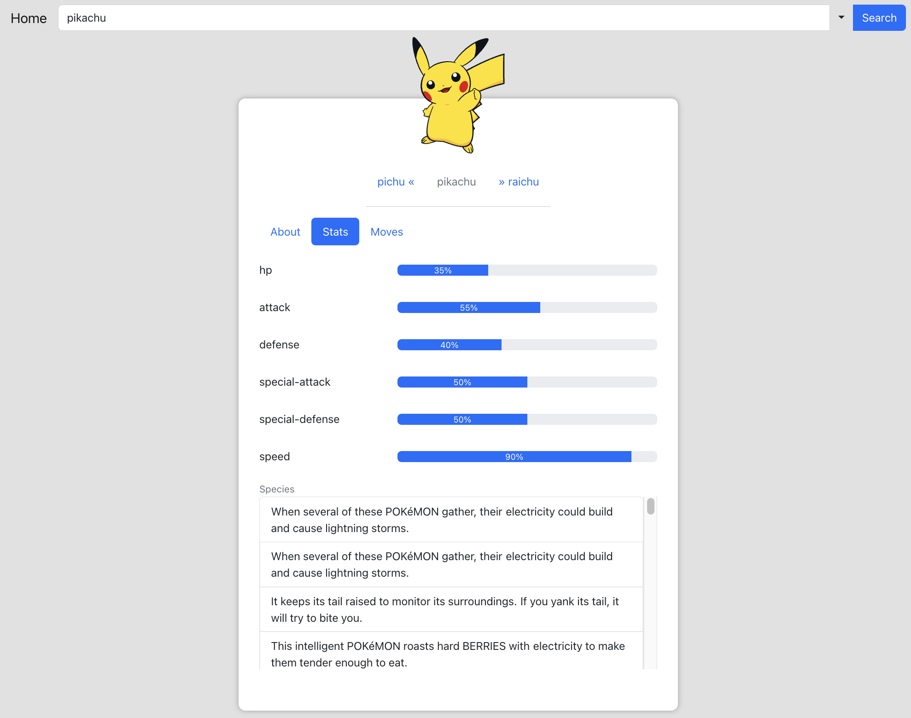

# Pokedex

This application was created using the create-react-app. To run the application you can run `npm start` and to build the application you can run `npm run build` which are standard with `create-react-app`. To run tests, run `npm test` or `npm test -- --coverage .` to get the coverage report. Some files are excluded from the test coverage and the list of these files are under `package.json`. They were excluded as either implementation detail or they would be tested through integration tests which is not in the scope of this implementation. 

Since the application is using React 18, concurrent rendering is supported out of the box. Pre react 18 you would have to use concurrend mode. 

To generate new components generate-react-cli is used. This just creates an empty component with a test file. 

